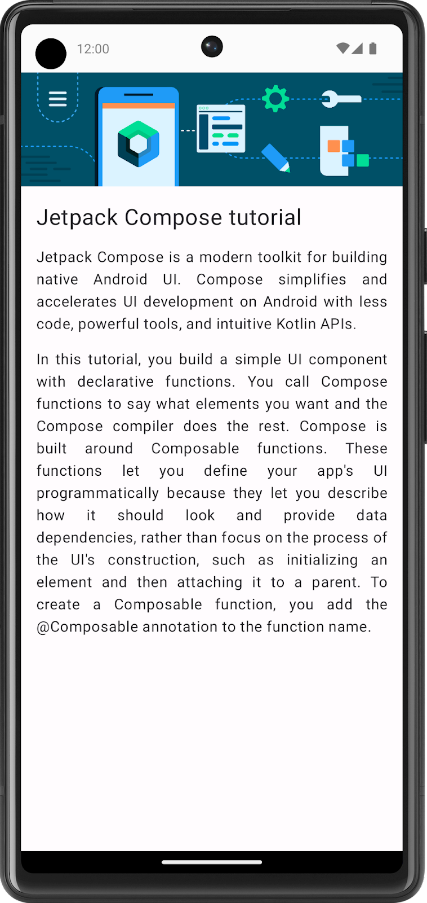
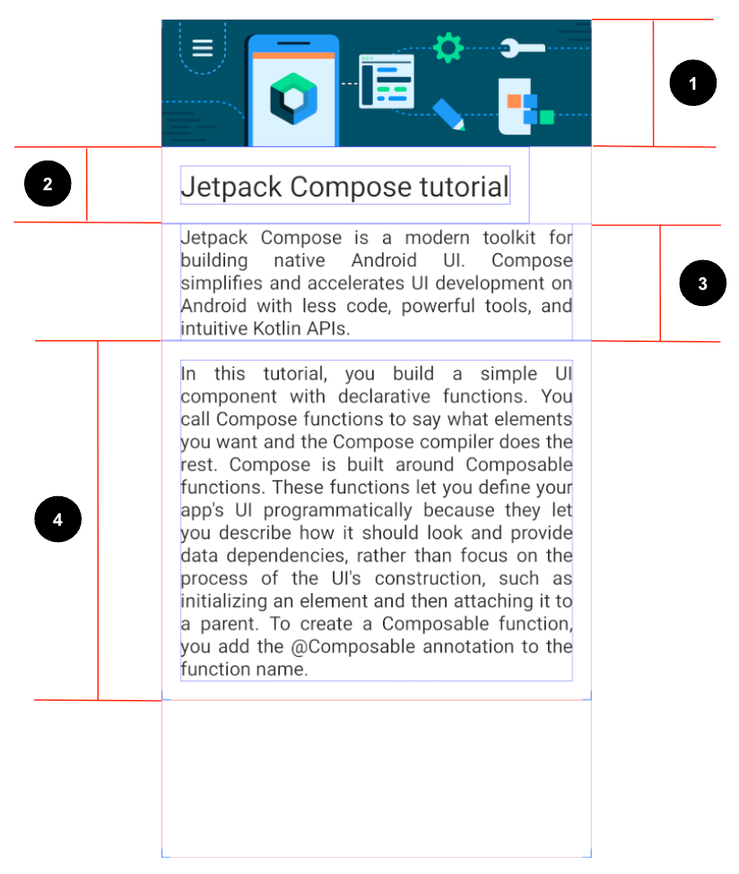

# Learn Together

A practice codelab session for Jetpack Compose

## Compose article

The Learn Together app displays a list of articles about several Jetpack libraries. Users can choose
the topic of their choice and learn about its latest developments.

In this exercise, you build a screen for the app, which displays a tutorial for Jetpack Compose. You
use the image and string resources provided in the Resources section for this problem.

### Final screenshot

### UI specifications

Follow this UI specification:

1. Set the image to fill the entire screen's width.
2. Set the first Text composable to a 24sp font size and 16dp padding (start, end, bottom, and top).
3. Set the second Text composable to a default font size, 16dp padding(start and end), and Justify
   text align.
4. Set the third Text composable to a default font size, 16dp padding (start, end, bottom, and top),
   and Justify text align.

### Resources

You need
this [image](https://github.com/google-developer-training/basic-android-kotlin-compose-training-practice-problems/blob/main/Unit%201/Pathway%203/ComposeArticle/app/src/main/res/drawable-nodpi/bg_compose_background.png)
to import into your project and these strings:

* Jetpack Compose tutorial
* Jetpack Compose is a modern toolkit for building native Android UI. Compose simplifies and
  accelerates UI development on Android with less code, powerful tools, and intuitive Kotlin APIs.
* In this tutorial, you build a simple UI component with declarative functions. You call Compose
  functions to say what elements you want and the Compose compiler does the rest. Compose is built
  around Composable functions. These functions let you define your app\'s UI programmatically
  because they let you describe how it should look and provide data dependencies, rather than focus
  on the process of the UI\'s construction, such as initializing an element and then attaching it to
  a parent. To create a Composable function, you add the @Composable annotation to the function
  name.

